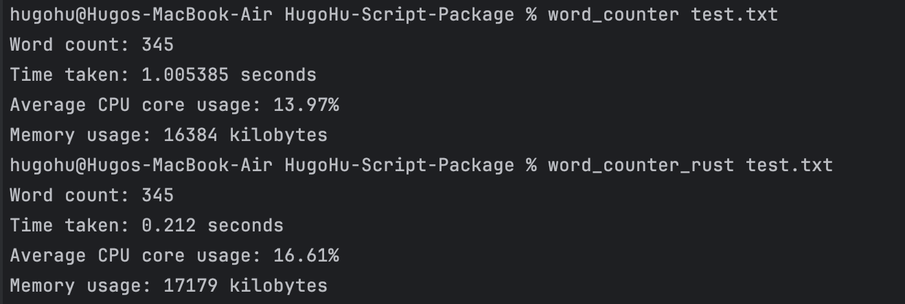

## Week 7 Mini-project

> © Yadong (Hugo) Hu 2023
> 
> This project was generated by this [Awesome Template](https://github.com/0HugoHu/IDS706-Python-Template)

<br />

**Requirements: Rewrite a Python script for data processing in Rust, highlighting the improvements in speed and resource usage.**


## Project Description
Word Counter Command-Line Tool in <i> Rust </i> and <i> Python </i>

This is a simple command-line tool that counts the number of words in a text file.

## Installation

1. Clone the repository or download the source code.
2. Navigate to the project directory.
3. Install the package in editable mode:

```bash
# Python Version
pip3 install -e .

# Rust Version
cd rust-package
cargo install --path .
```

## Usage

To count words in a text file, use the following command:
```bash
# Python Version
word_counter <path_to_text_file>

# Rust Version
word_counter_rust <path_to_text_file>
```

e.g., count the word count in ```test.txt```


To see the guide, run
```bash
word_counter --help
```

## Result
For the Python version, the running time is ```1.005385s```, which is far slower than the Rust version ```0.212000s```.

The CPU and Memory usage are almost the same, and it really depends on the current system load. The reason the Rust version is a little bit slower probably because the external sysinfo package is slow.




## Run

### Some Makefile Commands
```commandline
make clean
make install
make format
make lint
make test
make run
```
